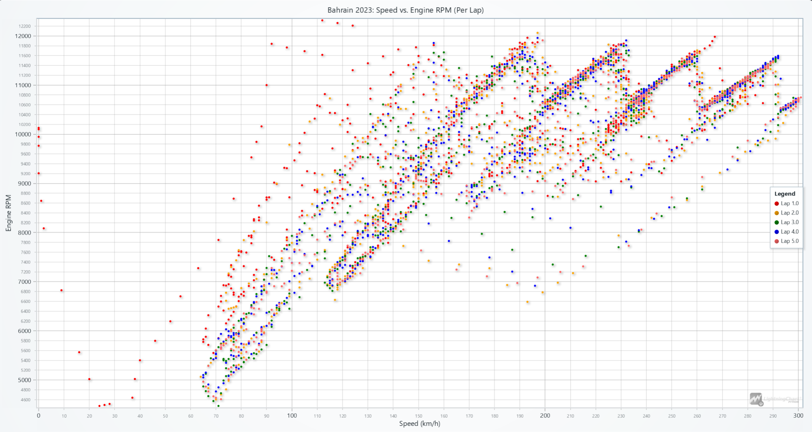

# Creating a Formula 1 Data Analysis in Python with LightningChart

## What is Formula 1 Data Analysis?
Formula 1 (F1) racing is a pinnacle of speed and technology, where data plays a crucial role in determining outcomes on and off the track. Teams collect vast amounts of telemetry and performance data to optimize their cars, drivers, and race strategies.

The types of data collected include:
- **Telemetry Data**: Speed, throttle, brake usage, and gear shifts.
- **Mechanical Data**: Tire temperatures, wear levels, engine RPM, and suspension dynamics.
- **Strategy Data**: Pit stop timing, fuel consumption, and track conditions.
- **Environmental Data**: Weather conditions, track temperature, and surface properties.

Through data analysis, teams can improve race performance, fine-tune strategies, and enhance car development.

---

## Types of Telemetry Data in F1
In F1, telemetry data is crucial for understanding the car’s performance and the driver’s inputs in real time. Here are the main types of telemetry data used:

- **Telemetry Data**:
  - **Speed and Throttle**: Provides insights into acceleration and cornering behavior.
  - **Brake Usage**: Helps evaluate braking efficiency and control.
  - **Steering Input**: Tracks driver inputs for understanding racing style.

- **Mechanical Data**:
  - **Tire Data**: Includes wear, temperature, and grip levels to optimize pit stops and maintain performance.
  - **Engine Data**: Tracks RPM and power output for evaluating reliability and performance.
  - **Suspension Metrics**: Analyzes handling and ride quality.

- **Strategy Data**:
  - **Pit Stops**: Determines optimal timings to minimize lap time loss.
  - **Fuel Usage**: Balances speed and weight to improve efficiency.

- **Environmental Data**:
  - **Weather and Temperature**: Impacts tire choices and car setup.
  - **Track Conditions**: Determines grip levels for tailoring driving strategies.

---

## LightningChart Python

### Overview of LightningChart Python
LightningChart is a high-performance data visualization library designed for applications like F1 telemetry analysis. It supports a range of interactive and customizable charts, ideal for handling large datasets in real time.

### Features and Chart Types to be Used in the Project
In this project, we utilize several chart types:
- **Gauge Chart**: Real-time monitoring of engine RPM, gear, and speed to assess car performance.
- **3D Track with Braking Areas**: Displays the car's track path in 3D with braking zones, providing spatial insight into braking patterns.
- **Heatmap (Track Position vs. Speed)**: Shows speed distribution on the track, indicating faster and slower sections.
- **Heatmap (Track Position vs. Gear Usage)**: Displays gear usage by track position, revealing the driver's shifting patterns.
- **Multi-Line Chart**: Plots acceleration, throttle, engine RPM, gear, and speed for each lap, providing a comparative view of key metrics.
- **Scatter Plot (Speed vs. Engine RPM)**: Analyzes the relationship between speed and engine RPM to understand engine performance.
- **Line Chart (Engine RPM, Speed, and Throttle)**: Monitors these metrics to correlate engine performance and speed.

### Performance Characteristics
LightningChart excels in rendering large datasets with minimal latency, making it suitable for real-time monitoring and analysis. It ensures smooth interactions such as zooming, panning, and updating dashboards dynamically.

---

## Setting Up Python Environment

### Installing Python and Necessary Libraries
Install Python and the required libraries using the following commands:

```bash
pip install lightningchart==0.9.3
pip install lightningchart fastf1 pandas numpy
```

### Overview of Libraries Used
Here are the main libraries used in this project:
- **NumPy**: Efficient numerical calculations and handling of large datasets.
- **Pandas**: Data manipulation and telemetry organization.
- **LightningChart**: High-performance visualization of complex datasets.
- **Trimesh**: Handling 3D models for dynamic visualizations.
- **Asyncio**: Real-time updates for non-blocking animations.
- **Math**: Trigonometric calculations and distance measurements for 3D modeling.
- **`interp1d` (SciPy)**: Smooth interpolation of telemetry data for even spacing.

### Setting Up Your Development Environment
1. Set up a virtual environment:
   ```bash
   python -m venv f1_env
   source f1_env/bin/activate  # Windows: f1_env\Scripts\activate
   pip install -r requirements.txt
   ```
2. Use **Visual Studio Code (VSCode)** for a streamlined development experience.

---

## Loading and Processing Data

In this project, we utilize telemetry data from a Formula 1 car across multiple laps. This dataset includes metrics such as speed, throttle position, brake usage, and tire temperature, as well as information about track position and engine performance.

### How to Load the Data Files
Using the FastF1 library, telemetry data for Max Verstappen’s fastest lap in Bahrain 2023 is loaded and processed:
```python
import fastf1
fastf1.Cache.enable_cache('Dataset/cache')

session = fastf1.get_session(2023, 'Bahrain', 'R')
session.load()
laps = session.laps.pick_driver('VER')
fastest_lap = laps.pick_fastest()
telemetry = fastest_lap.get_telemetry()
```

### Handling and Preprocessing the Data
Data handling and preprocessing involves interpolating telemetry and binning coordinates for heatmaps:

```python
import pandas as pd
import numpy as np

df = telemetry[['X', 'Y', 'Speed', 'nGear']].dropna()
df['position_x_binned'] = pd.cut(df['X'], bins=100, labels=False)
df['position_y_binned'] = pd.cut(df['Y'], bins=100, labels=False)
```

---

## Visualizing Data with LightningChart
LightningChart enables us to create a variety of visualizations to analyze telemetry data effectively. Let’s look at each chart created in this project and interpret the results.

# Creating the Charts

## 1. 3D Track Visualization with Braking Areas
- **Description**: This 3D visualization displays the Bahrain Grand Prix circuit using telemetry data, highlighting speed variations and braking zones. The track’s color gradient represents speed: blue for the lowest speeds and red for the highest. The blue points mark the braking areas where the driver slows down.
- **Results**: The chart highlights the key braking zones, which align with the corners of the track. The red sections indicate where the car reaches its maximum speed, typically in straights.
- **Use Case**: Teams can use this visualization to analyze braking patterns and optimize strategies for cornering and acceleration to improve lap times.

**Script Summary**:
```python
chart = lc.Chart3D()
track_series = chart.add_point_series(individual_lookup_values_enabled=True)
track_series.add_dict_data(data)
braking_series = chart.add_point_series()
braking_series.add(braking_x, braking_y, braking_z)
chart.open()
```


---

## 2. Track Position vs. Speed and Gear Usage
- **Description**: These heatmaps illustrate the average speed and gear usage at various binned track positions (X and Y). The speed heatmap uses color to indicate areas of higher speed (red) versus lower speed (yellow/white), while the gear heatmap shows gear usage across the track, with red indicating higher gears.
- **Results**: The speed heatmap reveals that straights are associated with higher speeds, while corners require lower speeds. The gear heatmap confirms the correlation between higher speeds and higher gears.
- **Use Case**: These heatmaps assist in understanding the driver’s technique and identifying opportunities to optimize gear ratios or cornering strategies for improved lap performance.

**Script Summary**:
```python
heatmap_speed = df.pivot_table(values='speed', index='position_x_binned', columns='position_y_binned')
heatmap_gear = df.pivot_table(values='gear', index='position_x_binned', columns='position_y_binned')
dashboard = lc.Dashboard()
speed_series = dashboard.ChartXY().add_heatmap_grid_series()
gear_series = dashboard.ChartXY().add_heatmap_grid_series()
dashboard.open()
```


---

## 3. Multi-Line Chart
- **Description**: This multi-line chart plots the top five telemetry parameters—acceleration, gear, brake intensity, engine RPM, and speed—over time for the first five laps. Each line corresponds to one lap, allowing for comparisons across laps.
- **Results**: This chart helps to evaluate consistency across laps. Variations in parameters such as braking intensity or speed indicate how the driver adjusts their technique based on track conditions or strategy.
- **Use Case**: Engineers and strategists can use this chart to identify patterns and improve driver performance or adjust car setup for better consistency.

**Script Summary**:
```python
chart = lc.ChartXY(title='Top 5 Data Columns for First 5 Laps')
for column in ['Speed', 'RPM', 'Throttle', 'Brake', 'nGear']:
    series = chart.add_line_series()
    series.add(df['Timestamp_ms'], df[column])
chart.open()
```
 

---

## 4. Scatter Plot of Speed vs. Engine RPM
- **Description**: This scatter plot visualizes the relationship between speed and engine RPM for each lap, with different colors representing individual laps.
- **Results**: The chart demonstrates a direct relationship between speed and engine RPM, where higher speeds correspond to higher RPM. This provides insights into engine performance during acceleration and high-speed sections.
- **Use Case**: Teams use this visualization to optimize engine power output and gear ratios for better acceleration and overall speed efficiency.

**Script Summary**:
```python
scatter_series = chart.add_point_series()
scatter_series.add(df['Speed'], df['RPM'])
scatter_series.set_point_color(color=lap_colors.get(lap))
chart.open()
```
  

---

## 5. RPM, Speed, and Throttle Over Time
- **Description**: This multi-line chart overlays engine RPM, speed, and throttle data over time, using separate Y-axes for clarity. The chart enables analysis of how these parameters interact during a lap.
- **Results**: The chart reveals a direct correlation between these three features. For instance, an increase in throttle input results in higher engine RPM and speed, highlighting the dynamic relationship between power delivery and acceleration.
- **Use Case**: This chart is critical for optimizing throttle response and analyzing how engine performance impacts lap times.

**Script Summary**:
```python
chart = lc.ChartXY(title="RPM, Speed, and Throttle Over Time")
chart.add_line_series().add(df['Timestamp_ms'], df['RPM'])
chart.add_line_series().add(df['Timestamp_ms'], df['Speed'])
chart.add_line_series().add(df['Timestamp_ms'], df['Throttle'])
chart.open()
```


---

## 6. Real-Time Dashboard with 3D Track and Nearest Driver
- **Description**: The dashboard integrates gauges for monitoring engine RPM, speed, and gear usage alongside a 3D track showing the car's live position. The red sphere represents the winning driver, Max Verstappen, while the yellow sphere represents the nearest competitor.
- **Results**: The gauges provide real-time insights into the car's performance, and the 3D track helps visualize Verstappen’s position relative to other drivers.
- **Use Case**: This setup is ideal for live race monitoring, allowing teams to make real-time decisions and communicate adjustments to the driver.

**Script Summary**:
```python
dashboard = lc.Dashboard()
rpm_gauge = dashboard.GaugeChart().set_interval(0, 12000)
speed_gauge = dashboard.GaugeChart().set_interval(0, 350)
gear_gauge = dashboard.GaugeChart().set_interval(0, 8)
track_chart = dashboard.Chart3D()
track_chart.add_line_series().add(ver_x, ver_y, ver_z)
dashboard.open()
```


---

# Data Visualization for Formula 1 Data Analysis
Data visualization is essential for interpreting telemetry data in F1, enabling teams to make quick decisions and strategize effectively. Real-time visualizations like gauge charts and 3D models allow for on-the-spot insights, while historical data visualizations like heatmaps and scatter plots help refine strategies for future races. Effective data visualization is key to understanding complex datasets and drawing actionable insights from them.
---

## Challenges in Formula 1 Data Analysis
1. **Data Complexity and Volume**: Requires efficient processing of vast amounts of telemetry data.
2. **Real-Time Requirements**: Instant analysis for on-the-spot decisions.
3. **Data Accuracy**: Critical for strategy and safety.

---

## Conclusion
Formula 1 data analysis is the cornerstone of modern racing. With tools like LightningChart and FastF1, teams can harness telemetry data to optimize performance and strategies, gaining a competitive edge. This project demonstrates how Python and advanced visualization tools unlock insights from complex data.
